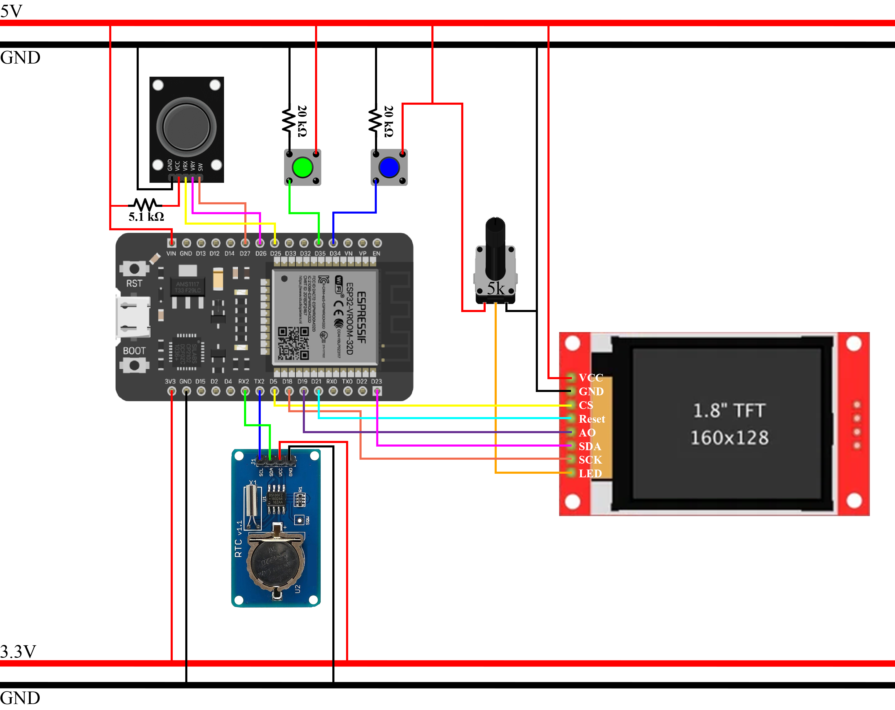

# GamingLad

ESP-WROOM-32 microcontroller code and circuit for three games. Games included are snake, minesweeper, and tic-tac-toe.

## Resources

The code was compiled and uploaded into a ESP-WROOM-32 board using the Arduino IDE. The components used:

 * ESP-WROOM-32: A ESP-WROOM-32D will work as well.
 * DS3231 RTC: Real-time clock for scoring minesweeper. 32k and SQW pins aren't included in the wiring diagram as their use isn't necessary.
 * 1.8 inch SPI TFT ST7735: Screen for displaying games. 128x160 resolution, V1.1.
 * 5kΩ Linear Potentiometer: Brightness adjustment knob for screen.
 * Ky-023 Joystick: Most joysticks should work. The click function is used for marking flags in minesweeper, so feature is preferred but not required
 * 2 4-terminal buttons: Internally referred to as green and blue. The green button opens the menu and the blue button acts as a confirm/action button. Both use 20kΩ pull-down resistors.
 * 2x20kΩ and a 5.1kΩ resistor: Pull-down for the buttons and for the input voltage of the joystick.
 * 5v and 3.3v power supply: The RTC runs off 3.3V and all other components off 5V.

## Wiring Diagram

Once all the components are assembled, they can be wired like this:

